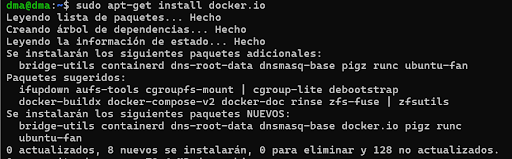
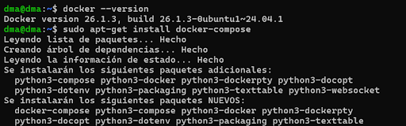
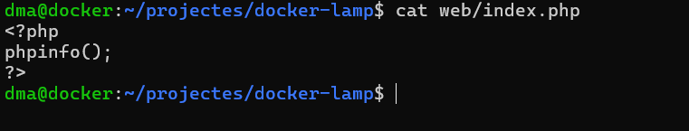
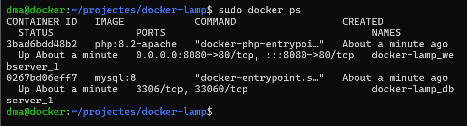
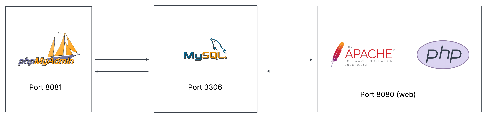

# <p align="center">  Introducció a Docker Compose i la seva sintaxis </p>
------------
Docker Compose permet definir l’arquitectura d’una aplicació mitjançant un sol fitxer. Permet desplegar tots els serveis de manera conjunta amb una sola comanda.
És una eina que permet gestionar aplicacions Docker. Mitjançant un fitxer amb format YAML, es poden declarar els serveis, xarxes i volums necessaris per a desplegar un entorn complet d’aplicació. Aquesta eina simplifica la gestió dels projectes que inclouen diversos serveis, com podria ser un entorn LAMP.

AQUEST ES EL NOSTRE ARTXIU DE CONFIGURACIÓ:
```
version: '3.8'

services:
  web:
    image: php:7.4-apache
    container_name: apache-php
    ports:
      - "80:80"  
    volumes:
      - ./www:/var/www/html  
    depends_on:
      - db  
    networks:
      - lamp-network

  # Servei de base de dades MySQL
  db:
    image: mysql:5.7
    container_name: mysql-db
    restart: always
    environment:
      MYSQL_ROOT_PASSWORD: 12345
      MYSQL_DATABASE: dma
      MYSQL_USER: dma
      MYSQL_PASSWORD: 12345
    volumes:
      - db_data:/var/lib/mysql  
    networks:
      - lamp-network

  # Servei phpMyAdmin (opcional)
  phpmyadmin:
    image: phpmyadmin/phpmyadmin
    container_name: my-phpmyadmin
    depends_on:
      - db
    ports:
      - "8080:80"
    environment:
      PMA_HOST: db
      MYSQL_ROOT_PASSWORD: 12345
    networks:
      - lamp-network

# Definició de la xarxa
networks:
  lamp-network:
    driver: bridge

# Definició de volums
volumes:
  db_data:

```

# <p align="center">  Configuració de l’entorn per a ús de Docker Compose.  </p>
------------
El primer pass ha de ser instal·lar (en cas de que no ho este ja), el docker, ho farem amb la següent comanda:
```
sudo apt-get install docker.io
```

<br>
Seguidament haurem de activar i revisar el estat del docker:
```
sudo systemctl start docker
sudo systemctl enable docker
```

<br>
Després revisem la versió del docker, amb la següent comanda:
```
docker --version
```

<br>
Ara el que hem de fer es instal·lar el docker compose.
```
sudo apt-get install docker-compose
```

<br>
Revisem la versio per si de cas:
```
docker-compose up -d
```
També podem utilitzar aquesta comanda:
```
docker-compose --version
```
El següent pas es revisar els contenidors:
```
docker-compose ps
```


# <p align="center">  Disseny i creació d’un entorn multi-contenidor amb Docker Compose </p>
------------
El nostre esquema i disseny es basa en el que es veu a la captura, amb la configuració dels ports


***
| Servei         | Contenidor       | Port Extern | Port Intern |
|----------------|------------------|-------------|-------------|
| Apache + PHP   | web              | 8080        | 80          |
| MySQL          | db               | (no exposat)| 3306        |
| phpMyAdmin     | phpmyadmin       | 8081        | 80          |
***


