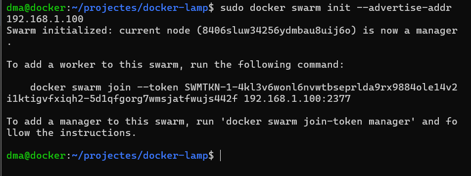
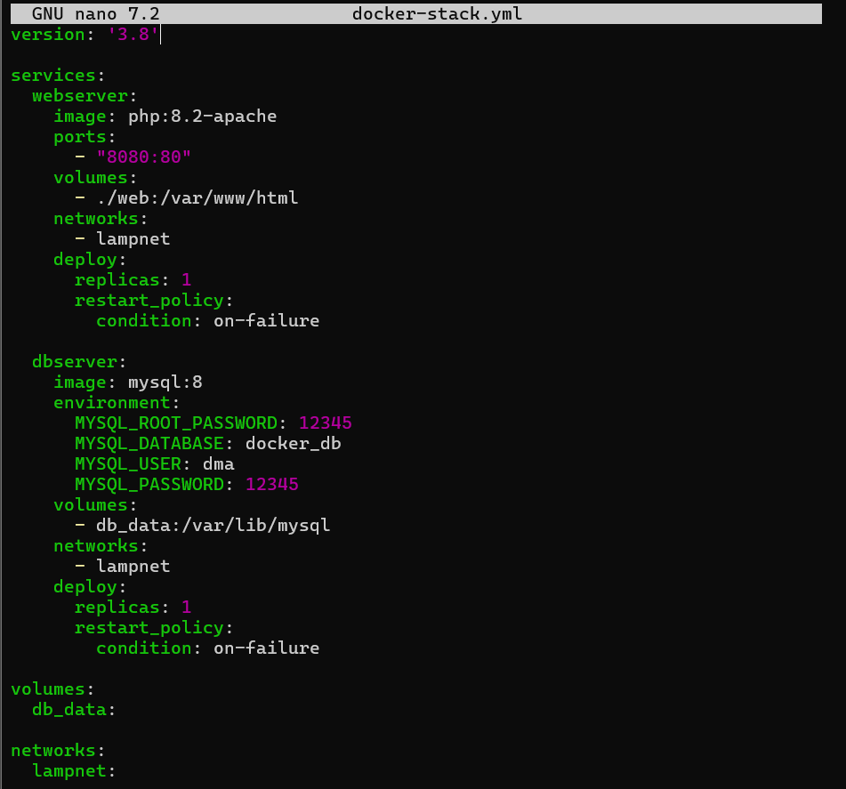
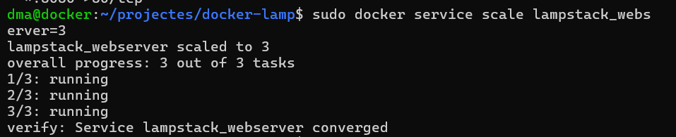
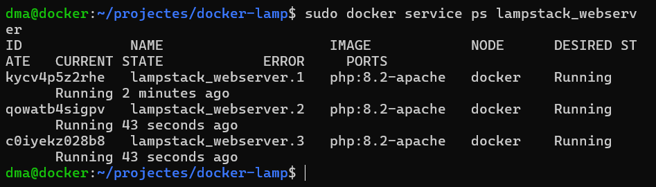

# <p align="center">  Orquestració i desplegament amb Docker Swarm  </p>
------------
## Principis de Docker Swarm <br>
Docker Swarm és una eina nativa de Docker, permet gestionar múltiples contenidors distribuïts en diversos nodes, formant un clúster. 
Proporciona alta disponibilitat i escalabilitat a l'administració d'aplicacions en contenidors.​

Ara expliquem els principis bàsics del Docker Swarm:
- Node: Cada màquina que forma part del clúster. Pot ser un node manager (gestiona el clúster) o worker (executa tasques assignades).​
- Servei: Defineix la tasca que ha d'executar-se en el clúster, especificant la imatge del contenidor i les opcions de configuració.​
- Tasca (Task): Instància d'un contenidor que forma part d'un servei i s'executa en un node.​
- Stack: Conjunt de serveis que conformen una aplicació completa, definits en un arxiu de configuració.
## Configuració d’un clúster amb Swarm 
Un cop hem tingut Docker instal·lat, hem executat la següent comanda per inicialitzar el clúster i convertir la màquina en **manager**:
```
sudo docker swarm init --advertise-addr 192.168.1.100
```

<br>
Això ens ha retornat també la comanda per afegir nous nodes al clúster, per si més endavant volem fer proves amb més màquines virtuals.

## Migració de Docker Compose a Docker Swarm
Docker Swarm permet desplegar serveis utilitzant fitxers docker-compose, però cal adaptar-los una mica. Hem creat un nou fitxer anomenat docker-stack.yml on
hem afegit la secció deploy per poder controlar rèpliques i polítiques de reinici. 


## Desplegament de l’stack
Per desplegar el projecte com a stack Swarm, hem executat:

<br>
Després, per veure l’estat dels serveis:

<br>
## Escalat dels serveis
Una de les funcionalitats més interessants de Swarm és que podem escalar fàcilment qualsevol servei. Per practicar-ho, hem decidit escalar el servidor web a **3 rèpliques** amb aquesta comanda:
```
docker service scale lampstack_webserver=3
```

<br>
Després hem comprovat l’estat de les rèpliques amb:
```
docker service ps lampstack_webserver
```

<br>

# README
### [Fase 1](https://github.com/miguelIH/Projecte-Github/blob/main/01_Projecte-Docker-Orquestradors-Basic/Fase_1_Configuracions_i_desplegament_amb_Docker_Compose/Documentacio.md)
### [Fase 3](https://github.com/miguelIH/Projecte-Github/blob/main/01_Projecte-Docker-Orquestradors-Basic/Fase_3_Seguretat_a_Docker_Swarm/Documentacio.md)
### [Fase 4](https://github.com/miguelIH/Projecte-Github/blob/main/01_Projecte-Docker-Orquestradors-Basic/Fase_4_Orquestraci%C3%B3_amb_Kubernetes/Documentacio.md)
