# <p align="center">  Seguretat a Docker Swarm  </p>
------------
## Introducció 
En aquesta fase ens hem centrat en millorar la seguretat del nostre clúster Docker Swarm. Docker Swarm ja implementa diverses mesures de seguretat per defecte, com per exemple:
•	Xifrat de comunicacions entre nodes
•	Autenticació mútua amb certificats
•	Rotació automàtica de claus
Tot i així, hem volgut veure com es poden **analitzar possibles vulnerabilitats** i aplicar millores manuals per protegir millor els serveis i el clúster.

## Comprovació de la seguretat per defecte
Un cop inicialitzat el clúster amb:
```
sudo docker swarm init --advertise-addr 192.168.1.100
```
Docker Swarm ja genera automàticament certificats TLS per a la comunicació entre nodes. Hem comprovat-ho accedint a:
```
ls /var/lib/docker/swarm/certificates
```
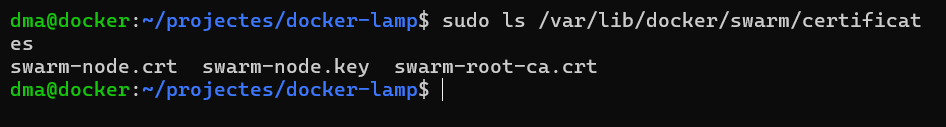
<br>
## Autenticació i control d'accés
Per reforçar el control d’accés al clúster, hem fet servir el token d’unió que es genera automàticament amb la comanda docker swarm join-token.
```
docker swarm join-token worker
```
```
docker swarm join-token manager
```
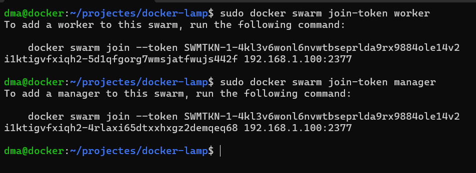
<br>
Aquestes comandes ens permetrien afegir nous nodes de forma segura, ja que cada node ha de tenir el seu token corresponent.
## Rotació de claus de seguretat
Per assegurar que els certificats i les claus no quedin exposats o caducats, hem fet una **rotació manual de les claus** amb la següent comanda:
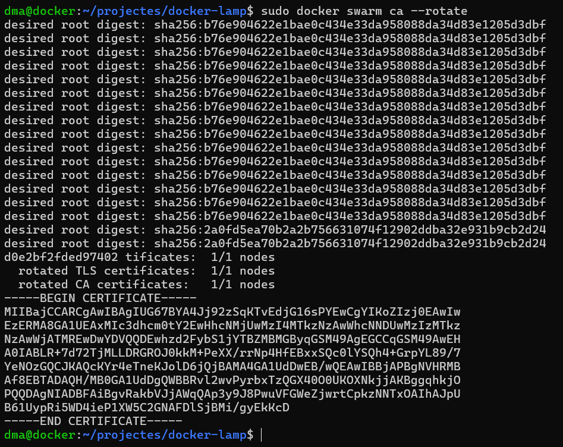
<br>
Això força a tots els nodes del clúster a renovar els certificats de comunicació, augmentant la seguretat.
## Unir el node.
Amb el node principal:
```
docker swarm join-token worker
```
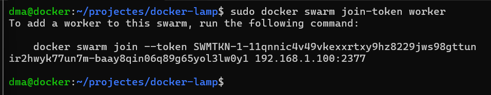
<br>
Amb el node secundari agafem la comanda i la executem:
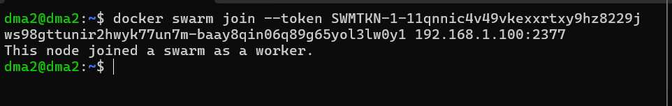
<br>
Ara, per comprobar que el node s’ha unit correctament executem la següent comanda:
```
docker node ls
```
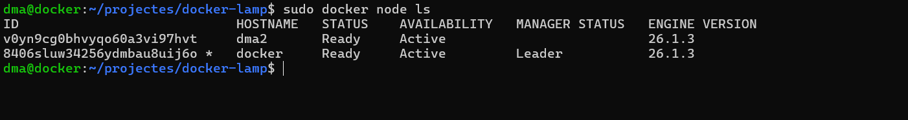
<br>
En aquest cas es veuen els dos nodes el primer que es el secundari “dma2” i l’altre que es el principal
## COMPROVACIO DE QUE EL NODE S’ACTUALIZA CORRECTAMENT
Primer creen un servei desde el node principal:
```
docker service create --name test-nginx --replicas 2 -p 8081:80 nginx
```
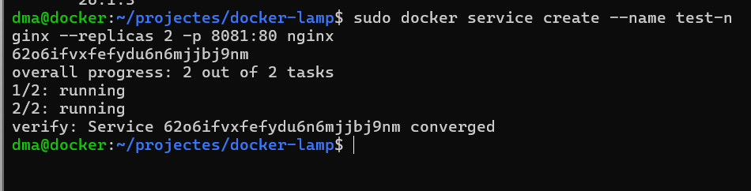
<br>
Aquesta comanda ha creat un servei anomenat test-nginx amb 2 rèpliques, van amb el port 80 del contenidor com a port 8081 del host. L’objectiu és poder accedir-hi des del navegador de la màquina física.
Amb la comanda:
```
docker service ls
```
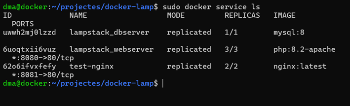
<br>
Podem veure que les 2 repliques están actives i amb la comanda:
```
docker service ps test-nginx
```
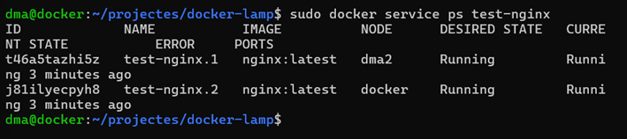
<br>
Això ens confirma que Docker Swarm ha distribuït les rèpliques automàticament entre el node manager i el node worker.

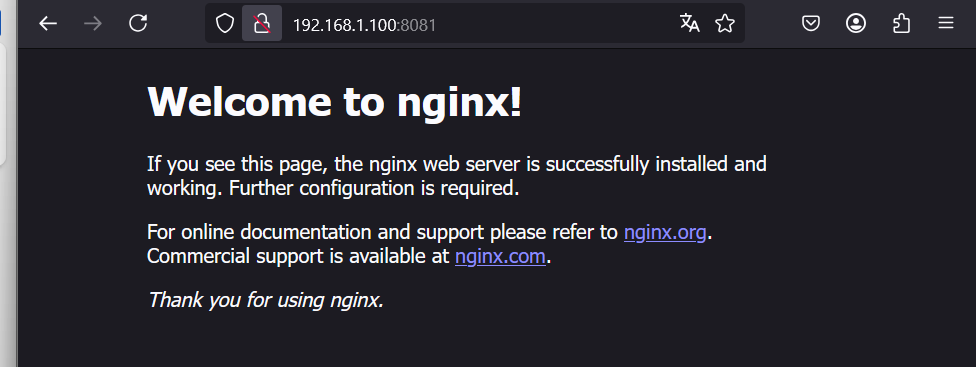
<br>
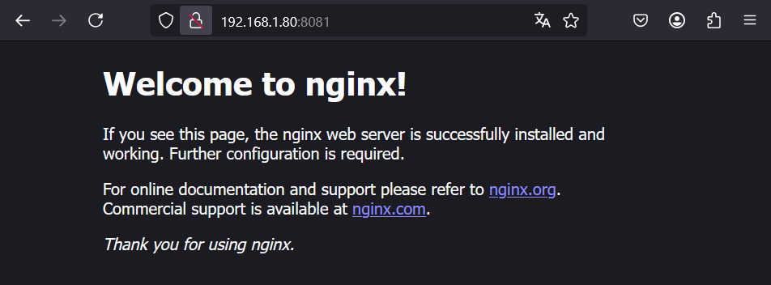
<br>
Podem veure que tan amb la ip del principal com la del secundari funciona sense cap mena de problema


# README
### [Fase 1](https://github.com/miguelIH/Projecte-Github/blob/main/01_Projecte-Docker-Orquestradors-Basic/Fase_1_Configuracions_i_desplegament_amb_Docker_Compose/Documentacio.md)
### [Fase 2](https://github.com/miguelIH/Projecte-Github/blob/main/01_Projecte-Docker-Orquestradors-Basic/Fase_2_Orquestraci%C3%B3_i_desplegament_amb_Docker_Swarm/Documentacio.md)
### [Fase 4](https://github.com/miguelIH/Projecte-Github/blob/main/01_Projecte-Docker-Orquestradors-Basic/Fase_4_Orquestraci%C3%B3_amb_Kubernetes/Documentacio.md)
