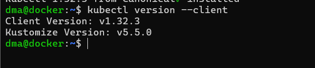
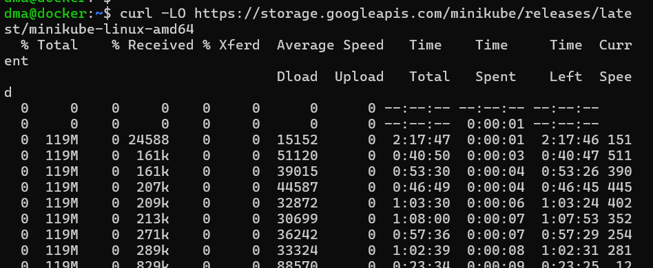
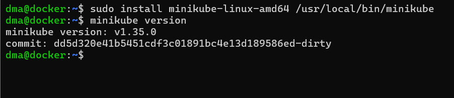
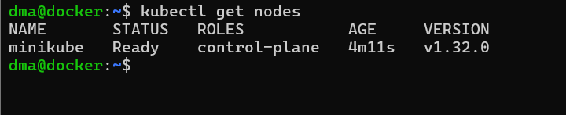
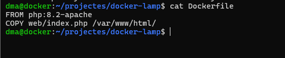
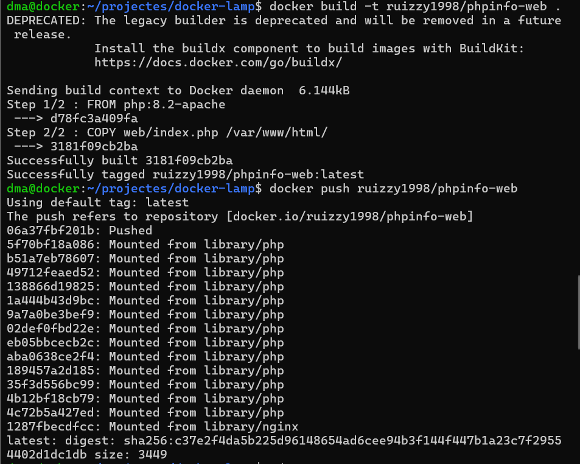
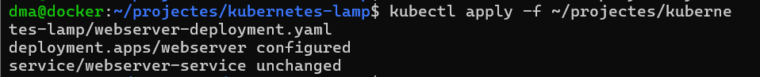
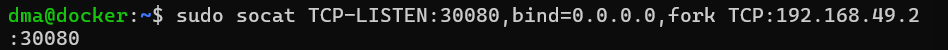
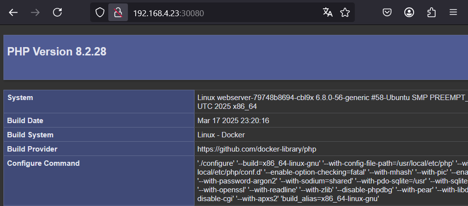

# <p align="center"> Orquestració amb Kubernetes   </p>
------------
## Introduccio
Introducció a Kubernetes
Aquesta fase ens ha sebrvit per aprendre a utilitzar **Kubernetes**, un sistema d’orquestració de contenidors molt més potent i complex que Docker Swarm. Tot i que té una corba d’aprenentatge més pronunciada, ofereix moltes més opcions de gestió, escalabilitat i disponibilitat.
Hem treballat amb **Minikube** per muntar un clúster de Kubernetes local dins la nostra màquina virtual i hem migrat el projecte que havíem fet amb Docker Compose i Docker Swarm a Kubernetes.

## Comparació entre Docker Swarm i Kubernetes
Abans de començar, hem fet una comparació entre Docker Swarm i Kubernetes per entendre millor les diferències entre els dos orquestradors:
| Aspecte                  | Docker Swarm                        | Kubernetes                                   |
|--------------------------|-------------------------------------|----------------------------------------------|
| Configuració inicial     | Simple i ràpida                     | Més complexa                                 |
| Escalat                  | Bàsic però funcional                | Més controlat i automàtic                    |
| Monitorització           | Limitada                            | Integrada amb eines com Prometheus           |
| Fitxers de configuració  | `docker-compose.yml`               | Fitxers YAML                                 |
| Ús en producció          | Menys habitual                      | Estàndard de la indústria                    |

## Preparació de l’entorn amb Minikube 	
Per provar Kubernetes de manera local, hem fet servir **Minikube**, que ens permet crear un clúster en una sola màquina virtual per fer pràctiques.

## Passos que hem seguit:
**Instal·lar kubectl**:
A causa de problemes amb el repositori oficial de Kubernetes (el repositori xenial ja no és compatible amb Ubuntu 24.04), hem optat per una via més senzilla i compatible: instal·lar kubectl amb Snap.
Aquesta eina ens permet gestionar el clúster de Kubernetes, crear serveis, controlar pods i desplegar aplicacions.

## Comanda d’instal·lació utilitzada
Des del terminal hem executat:
```
sudo snap install kubectl --classic
```

<br>
Aquest mètode és ràpid i automàtic, i ens evita haver d’afegir repositoris antics manualment. A més, Snap ens garanteix que tindrem una versió actualitzada i funcional.

## Verificació de la instalación
Per assegurar-nos que kubectl s’ha **instal·lat correctament**, hem fet:
```
kubectl version –client
```

<br>
Ens ha retornat la versió del client i **hem pogut confirmar que funciona correctament** i ja el tenim disponible al sistema per gestionar Kubernetes.

## Instal·lació de Minikube
Per poder practicar amb Kubernetes en un entorn local, hem utilitzat **Minikube**, que ens permet crear un **clúster de Kubernetes en una sola màquina virtual**.
Aquesta eina és ideal per fer proves, ja que ens simula el comportament d’un clúster real de forma senzilla i lleugera.

## Requisits previs
Abans d’instal·lar **Minikube**, hem comprovat que teníem:
•	Docker ja instal·lat (necessari perquè Minikube utilitza un driver com Docker o VirtualBox)
•	kubectl ja funcionant (instal·lat prèviament amb Snap)

## Descarregar i instal·lar Minikube
Hem baixat l’última versió de Minikube amb curl i l’hem instal·lat amb permisos d’administrador:
```
curl -LO https://storage.googleapis.com/minikube/releases/latest/minikube-linux-amd64
```

<br>
```
sudo install minikube-linux-amd64 /usr/local/bin/minikube
```
```
minikube version
```

<br>
## Iniciar el clúster amb Docker com a driver
Un cop instal·lat Minikube, hem engegat el clúster local amb Docker com a driver executant:
```
minikube start --driver=docker
```

<br>
Aquest procés ha trigat una mica, ja que ha descarregat les imatges necessàries i ha preparat els components del clúster:

- Certificats i claus <br>
- Pla de control (control plane) <br>
- Regles RBAC (permissos i rols) <br>
- Xarxa interna (CNI) <br>


<br>

Tot i que ens ha donat un **avís de poc espai en disc** (93%), el clúster s'ha iniciat correctament i ens indica:
> Done! kubectl is now configured to use "minikube" cluster and "default" namespace by default
Això vol dir que ja podem utilitzar kubectl per interactuar amb el clúster de Kubernetes.
## Comprovar que tot funciona
Per veure si el clúster està en funcionament i el node està en funcionament, hem fet:
Comprovar que tot funciona
Per veure si el clúster està en funcionament i el node està en funcionament, hem fet:
kubectl get nodes
```
kubectl get nodes
```

<br>
## Desplegament del servei webserver amb Kubernetes
Un cop hem tingut el clúster Minikube en funcionament i kubectl preparat, hem creat un fitxer YAML per desplegar el nostre **contenidor PHP amb Apache** i exposar-lo com a servei a través d’un port del node.
## Creació de la imatge Docker personalitzada
Per evitar l'error 403 Forbidden del contenidor per defecte de PHP, hem creat una imatge personalitzada amb un index.php que mostra phpinfo().
- **index.php** <br>
- **Dockerfile:** <br>
<br>


<br>
Des de la carpeta projectes/docker-lamp, hem construït i pujat la imatge al nostre Docker Hub:
<br>
```
docker build -t ruizzy1998/phpinfo-web
```
<br>

````
docker push ruizzy1998/phpinfo-web
````


<br>
## webserver-deployment.yaml
Hem creat un fitxer webserver-deployment.yaml amb el desplegament i el servei:

<br>
L'hem aplicat amb:
````
kubectl apply -f webserver-deployment.yaml
````

<br>
## Redirecció del port amb socat
Hem utilitzat la IP interna de Minikube (192.168.49.2) i l'hem redirigit des del port de la interfície bridge de la VM:
```
sudo socat TCP-LISTEN:30080,bind=0.0.0.0,fork TCP:192.168.49.2:30080
```

<br>
Això ens ha permès accedir al servei des del navegador del nostre PC físic:

<br>

Finalment aquesta va a ser la nostre **estructura** general:
<br>


# README
### [Fase 1](https://github.com/miguelIH/Projecte-Github/blob/main/01_Projecte-Docker-Orquestradors-Basic/Fase_4_Orquestraci%C3%B3_amb_Kubernetes/Documentacio.md)
### [Fase 2](https://github.com/miguelIH/Projecte-Github/blob/main/01_Projecte-Docker-Orquestradors-Basic/Fase_2_Orquestraci%C3%B3_i_desplegament_amb_Docker_Swarm/Documentacio.md)
### [Fase 3](https://github.com/miguelIH/Projecte-Github/blob/main/01_Projecte-Docker-Orquestradors-Basic/Fase_3_Seguretat_a_Docker_Swarm/Documentacio.md)

## 📁 01_Projecte-Docker-Orquestradors

- [Fase 1 - Configuracions i desplegaments](https://github.com/miguelIH/Projecte-Github/blob/main/01_Projecte-Docker-Orquestradors-Basic/Fase_1_Configuracions_i_desplegament_amb_Docker_Compose/Documentacio.md)
- [Fase 2 - Orquestració i desplegament](https://github.com/miguelIH/Projecte-Github/blob/main/01_Projecte-Docker-Orquestradors-Basic/Fase_2_Orquestraci%C3%B3_i_desplegament_amb_Docker_Swarm/Documentacio.md)
- [Fase 3 - Seguretat a Docker Swarm](https://github.com/miguelIH/Projecte-Github/blob/main/01_Projecte-Docker-Orquestradors-Basic/Fase_3_Seguretat_a_Docker_Swarm/Documentacio.md)
- [Fase 4 - Orquestració amb Kubernetes](01_Projecte-Docker-Orquestradors/Fase_4_Orquestració_amb_Kubernetes/Documentacio.md)

---

## 📁 02_Projecte-Docker-Orquestradors

- [Fase 1 - Docker Swarm Escalat, backups i gestió](02_Projecte-Docker-Orquestradors/Fase_1_Docker_Swarm_Escalat_backups_i_gestio/Documentacio.md)
- [Fase 2 - Kubernetes Alta disponibilitat](02_Projecte-Docker-Orquestradors/Fase_2_Kubernetes_Alta_disponibilitat/Documentacio.md)
- [Fase 3 - Kubernetes Gestió de recursos](02_Projecte-Docker-Orquestradors/Fase_3_Kubernetes_Gestio_de_recursos/Documentacio.md)
- [Fase 4 - Kubernetes Eines complexes](02_Projecte-Docker-Orquestradors/Fase_4_Kubernetes_eines_complexes/Documentacio.md)
