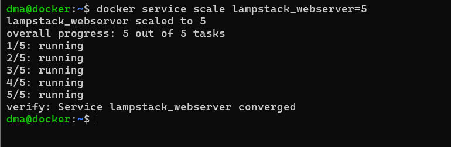

# <p align="center"> Docker Swarm: Escalat, balanceig i monitorització </p>
------------
Aquesta primera fase del projecte avançat l'hem dedicat a millorar el clúster Docker Swarm que ja teníem fet, afegint funcionalitats que el fan més robust, escalable i preparat per a entorns reals.

## Estratègies d'escalat dinàmic

Per practicar l'escalat dels serveis, hem augmentat les rèpliques del webserver de 1 a 5. Això ho hem fet amb la comanda:
```
docker service scale lampstack_webserver=5
```

<br>
Per veure en quin estat estaven les rèpliques i si s’estaven executant correctament. Inicialment vam tenir problemes amb una de les rèpliques, que no s’aixecava perquè el directori ./web no existia en tots els nodes. Ho vam solucionar creant la mateixa ruta a dma2.

## Estratègies de desplegament avançat
Per evitar talls de servei en cas d’actualitzacions, hem afegit estratègies avançades al fitxer docker-stack.yml. Això ens permet fer canvis controlats, amb una sola rèplica actualitzant-se alhora, i rollback automàtic si alguna cosa falla.
<br>
Aquest és el nou fitxer docker-stack.yml que hem fet servir:
<br>

<br>
