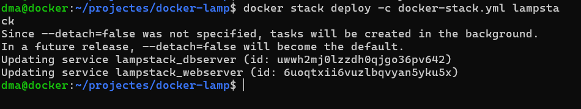
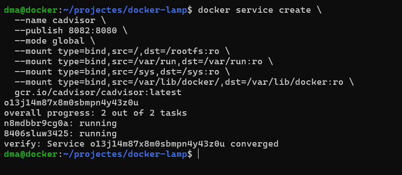
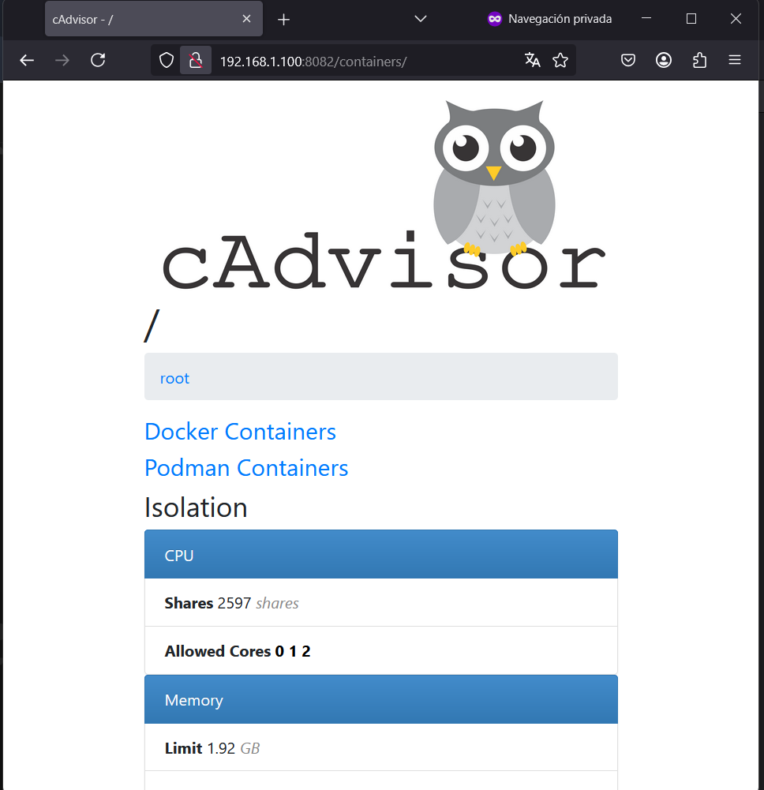
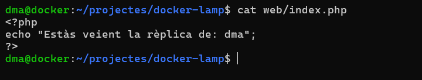
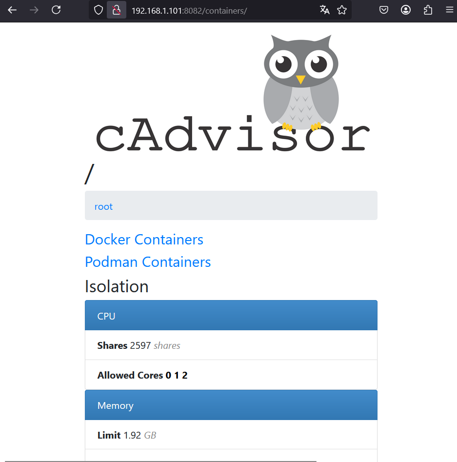
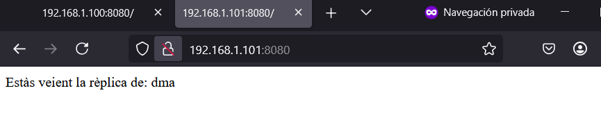

# <p align="center"> Docker Swarm: Escalat, balanceig i monitorització </p>
------------
Aquesta primera fase del projecte avançat l'hem dedicat a millorar el clúster Docker Swarm que ja teníem fet, afegint funcionalitats que el fan més robust, escalable i preparat per a entorns reals.

## Estratègies d'escalat dinàmic

Per practicar l'escalat dels serveis, hem augmentat les rèpliques del webserver de 1 a 5. Això ho hem fet amb la comanda:
```
docker service scale lampstack_webserver=5
```

<br>
Per veure en quin estat estaven les rèpliques i si s’estaven executant correctament. Inicialment vam tenir problemes amb una de les rèpliques, que no s’aixecava perquè el directori ./web no existia en tots els nodes. Ho vam solucionar creant la mateixa ruta a dma2.

## Estratègies de desplegament avançat
Per evitar talls de servei en cas d’actualitzacions, hem afegit estratègies avançades al fitxer docker-stack.yml. Això ens permet fer canvis controlats, amb una sola rèplica actualitzant-se alhora, i rollback automàtic si alguna cosa falla.
<br>
Aquest és el nou fitxer docker-stack.yml que hem fet servir:
<br>

<br>
Hem desplegat els canvis amb:
```
docker stack deploy -c docker-stack.yml lampstack
```

<br>
Gràcies a això, podem fer actualitzacions del servei web sense que es caigui, cosa molt important si estem treballant en un entorn real on no podem permetre que els usuaris es quedin sense servei.

## Monitorització amb cAdvisor
Per veure l'estat dels contenidors en temps real, hem instal·lat cAdvisor com a servei global, així s’executa a tots els nodes del clúster:
Hem executat aquesta comanda des del node manager:
```
docker service create \
  --name cadvisor \
  --publish 8082:8080 \
  --mode global \
  --mount type=bind,src=/,dst=/rootfs:ro \
  --mount type=bind,src=/var/run,dst=/var/run:ro \
  --mount type=bind,src=/sys,dst=/sys:ro \
  --mount type=bind,src=/var/lib/docker/,dst=/var/lib/docker:ro \
  gcr.io/cadvisor/cadvisor:latest
```

Un cop fet això, hem obert el navegador i hem anat a:
```
192.168.1.100:8082 (Ip del servidor + port 8082)
```
Ens apareix una web on podem veure tots els contenidors que s’estan executant en aquell node i quins recursos consumeixen.


<br>
Tambe podem accedir desde el node secundari:

<br>
Per poder monitoritzar el rendiment dels nostres serveis, hem instal·lat cAdvisor a cada node del clúster en mode global. Això ens ha permès veure el consum de CPU, RAM i altres recursos dels contenidors en temps real. És una eina molt útil per detectar problemes de rendiment o contenidors que consumeixen massa recursos.

## Balanceig de serveis i alta disponibilitat
Un cop hem tingut les rèpliques del webserver en marxa, hem comprovat el balanceig de càrrega obrint el navegador a:
```
http://192.168.1.100:8080
```

```
http://192.168.1.101:8080
```
Cada cop que refrescàvem la pàgina, hem vist que el servei responia correctament, i si afegim una petita variació a cada index.php (com mostrar l'hostname o un número), es pot veure com van canviant.
I refrescant diverses vegades. Per veure quina rèplica ens servia cada cop, hem afegit aquest codi al index.php:

<br>

<br>
## Prova de fallada d’un node
També hem provat a apagar el node dma2 amb poweroff i hem comprovat que el servei continuava funcionant. Docker Swarm ha mogut les rèpliques al node actiu automàticament.
```
docker node ls
```


Però el servei **ha continuat funcionant!** I el Swarm ha **reassignat automàticament les rèpliques fallades** a l’altre node (docker), assegurant que tot segueixi funcionant.
