# <p align="center"> Kubernetes: Alta disponiblitat i Monitorizació </p>
------------
## Configuració avançada de pods i serveis
Hem creat un fitxer YAML anomenat webserver-deployment.yaml per desplegar el servei web amb 3 rèpliques. Aquesta vegada hem fet servir l’objecte Deployment i hem exposat el servei amb un Service de tipus NodePort:
<br>
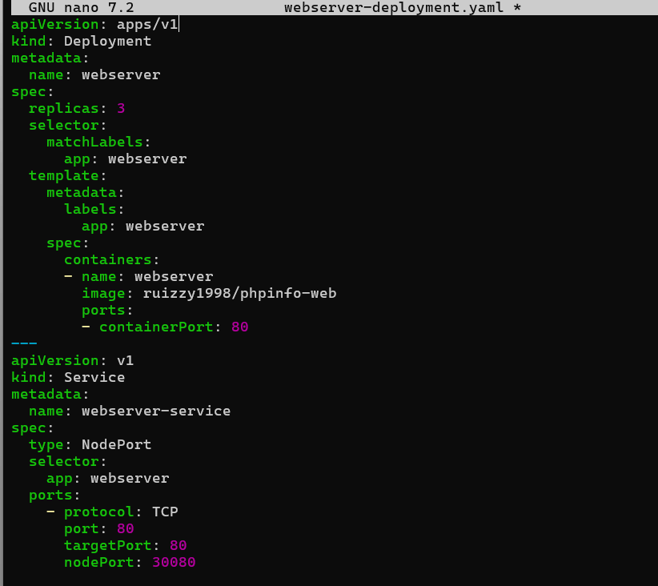
<br>
Hem aplicat la configuració amb:
```
kubectl apply -f webserver-deployment.yaml
```
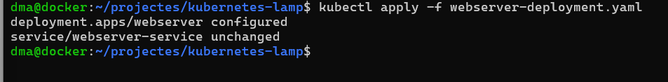
<br>
## Ús de volums persistents, ConfigMaps i Secrets
Per assegurar-nos que les dades de MySQL no es perden, hem començat a preparar un PersistentVolume i PersistentVolumeClaim, tot i que en Minikube només s’usa a nivell local.
També hem començat a treballar amb ConfigMap per gestionar configuracions PHP i Secrets per guardar contrasenyes de forma segura:
<br>
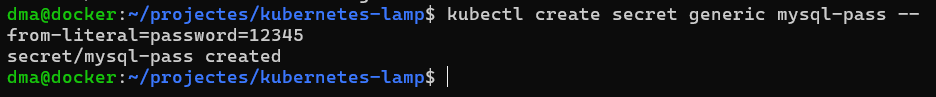
<br>
## Estratègies d’alta disponibilitat
El Deployment amb 3 rèpliques ja ens dona alta disponibilitat bàsica. Per reforçar-ho, hem afegit toleràncies per si un node falla
Per garantir la disponibilitat contínua dels serveis en entorns Kubernetes, hem aplicat diverses estratègies d’alta disponibilitat. Hem fet una taula amb els components implicats, les tècniques utilitzades i la seva finalitat:

| Component        | Estratègia aplicada                             | Finalitat                                      |
|------------------|--------------------------------------------------|------------------------------------------------|
| Pods             | Rèpliques (3)                                    | Redundància de servei                          |
| Nodes            | Pod Anti-Affinity                                | Separació de pods en nodes diferents           |
| Volums           | PersistentVolumeClaim (PVC)                      | Conservació de dades                           |
| Serveis          | LoadBalancer o Ingress Controller                | Balanceig de càrrega extern                    |
| Actualitzacions  | Rolling Update + Readiness/Liveness Probes      | Disponibilitat durant actualitzacions          |

## Monitorització amb Prometheus i Grafana
Per aquesta fase hem començat a instal·lar Prometheus i Grafana per veure com es comporten els pods en temps real. El primer en ser instal·lat es Prometheus que ho farem de la següent manera:
Creen el fitxer prometheus-deployment.yaml amb aquest contingut:
```
apiVersion: v1
kind: Service
metadata:
  name: prometheus
spec:
  selector:
    app: prometheus
  ports:
    - protocol: TCP
      port: 9090
      targetPort: 9090
  type: NodePort
---
apiVersion: apps/v1
kind: Deployment
metadata:
  name: prometheus
spec:
  replicas: 1
  selector:
    matchLabels:
      app: prometheus
  template:
    metadata:
      labels:
        app: prometheus
    spec:
      containers:
      - name: prometheus
        image: prom/prometheus
        ports:
        - containerPort: 9090
```
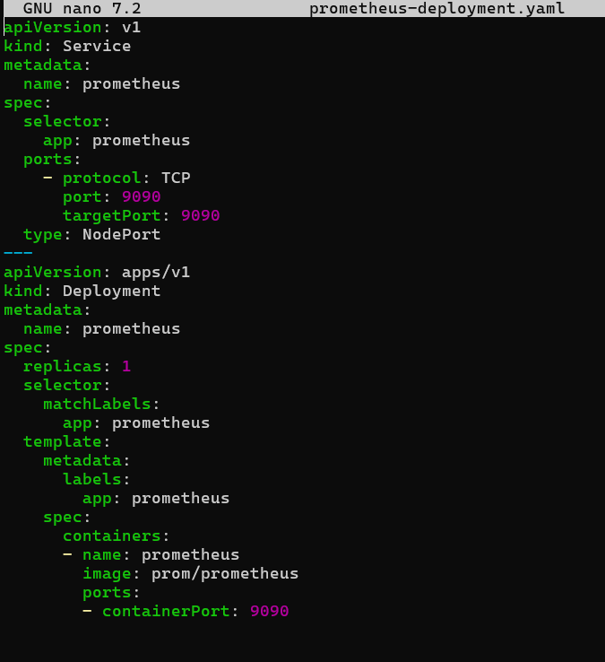
<br>
Despres ho apiquem amb:
```
kubectl apply -f prometheus-deployment.yaml
```
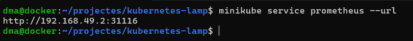
<br>
Consulta de l’URL amb Minikube:
```
minikube service prometheus --url
```

<br>
També es pot accedir des del navegador:
Primer creen el pont per poder accedir desde el servidor a la maquina real.
```
sudo socat TCP-LISTEN:31116,reuseaddr,fork TCP:192.168.49.2:31116
```
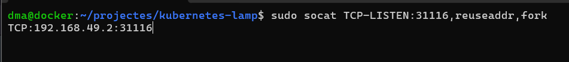
<br>
http://192.168.1.100:31116/
<br>
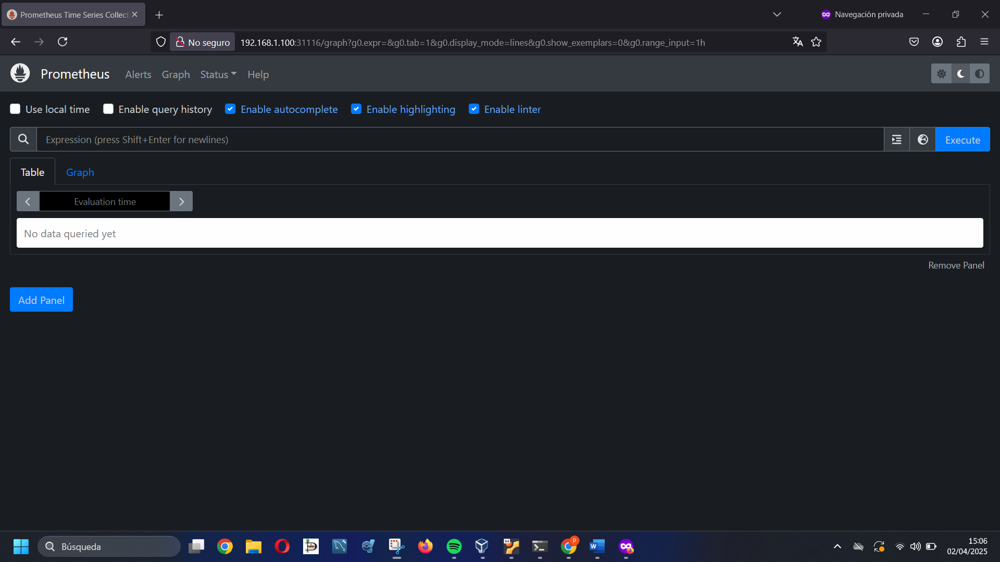
<br>
## Grafana
Fitxer grafana-deployment.yaml:
```
apiVersion: apps/v1
kind: Deployment
metadata:
  name: grafana
spec:
  replicas: 1
  selector:
    matchLabels:
      app: grafana
  template:
    metadata:
      labels:
        app: grafana
    spec:
      containers:
      - name: grafana
        image: grafana/grafana:latest
        ports:
        - containerPort: 3000
        env:
        - name: GF_SECURITY_ADMIN_USER
          value: "admin"
        - name: GF_SECURITY_ADMIN_PASSWORD
          value: "admin"
```
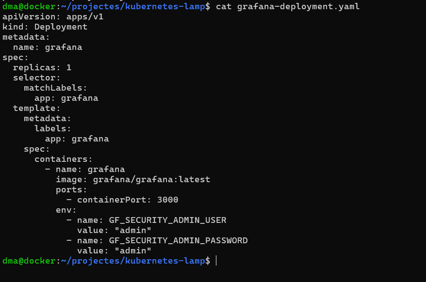
<br>
Fitxer grafana-service.yaml:
```
apiVersion: v1
kind: Service
metadata:
  name: grafana
spec:
  selector:
    app: grafana
  ports:
    - protocol: TCP
      port: 3000
      targetPort: 3000
  type: NodePort
```
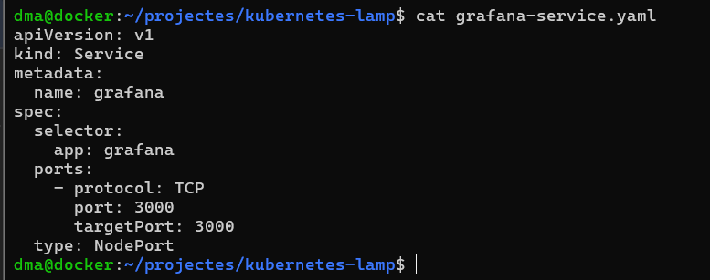
<br>
Desplegament:
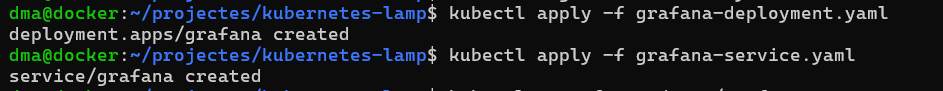
<br>
Després hem consultat l’URL:
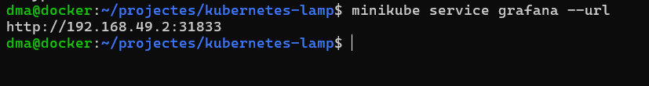
<br>
Ara farem el pont:
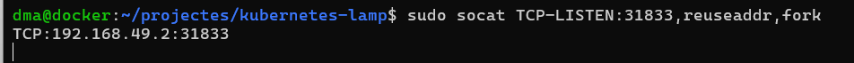
<br>
I hem accedit a:
```
192.168.1.100: 31833
```
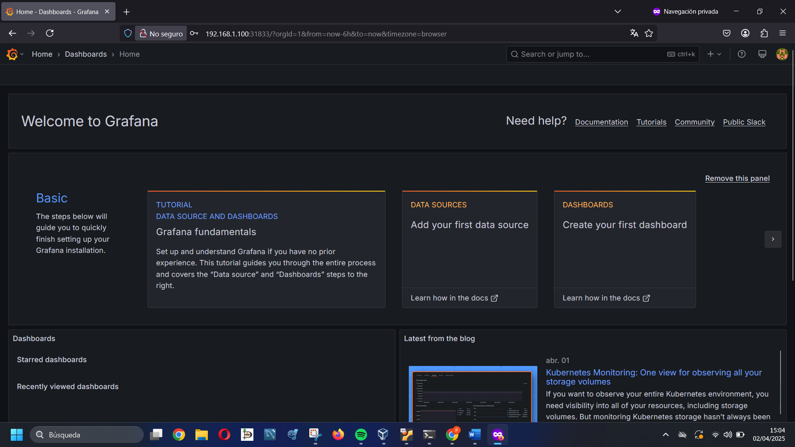
<br>
## Configuració del node-exporter
Hem creat el fitxer node-exporter-deployment.yaml amb les etiquetes necessàries perquè Grafana pugui detectar les instàncies:
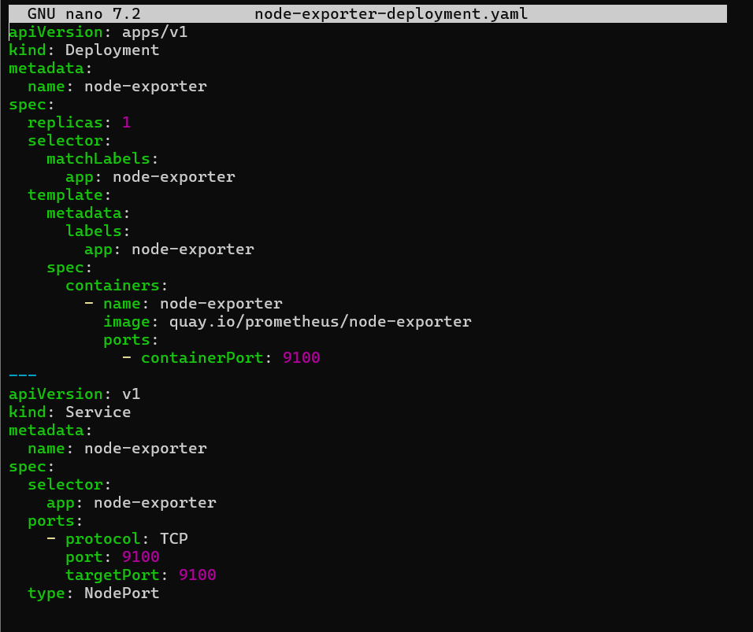
<br>
Un cop desplegat:
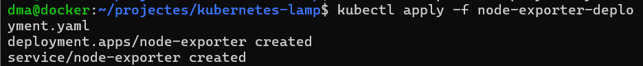
<br>
Aquí podem veure el desplegament desde prometheus:
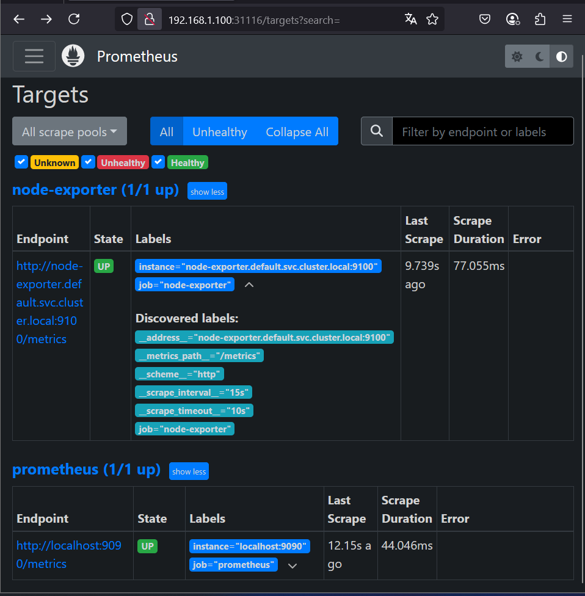
<br>
Admins de grafana podem conectarlo amb prometheus:
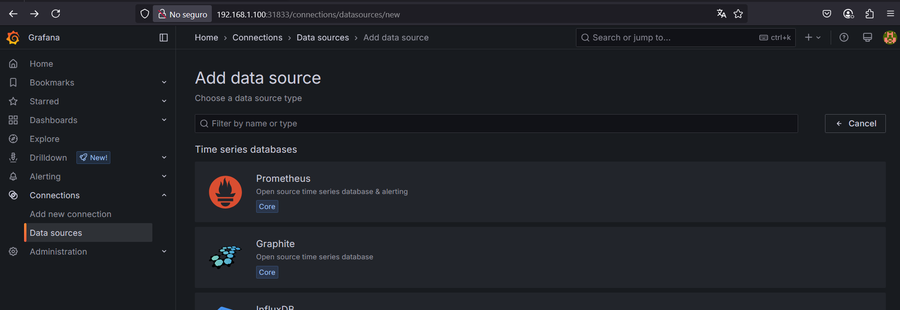
<br>
Podem la URL de prometheus: 
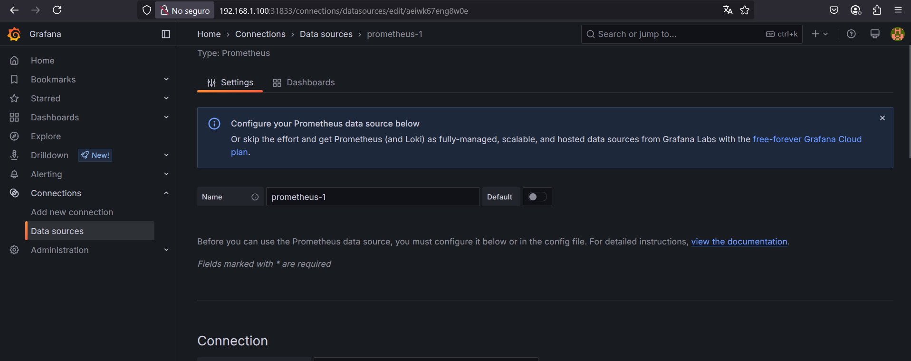
<br>
Misstage de que s’ha unit correctament:

<br>
Importem un DashBoard:
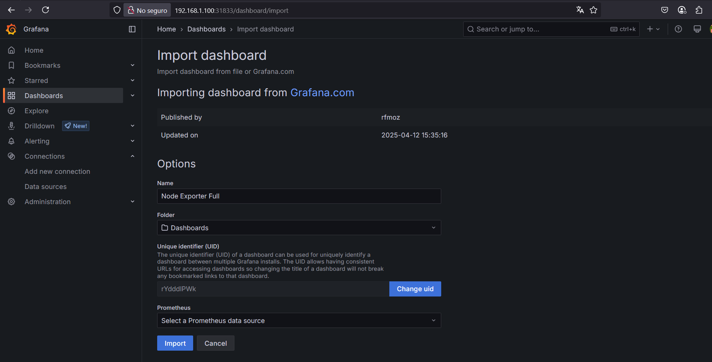
<br>
Ara a **Prometheus** veiem l’endpoint en estat UP, i des de **Grafana**, un cop importat el dashboard "Node Exporter Full", ja podem veure gràfiques com l’ús de CPU, RAM, disc, swap i més. 
Aquest és el resultat final que hem obtingut:
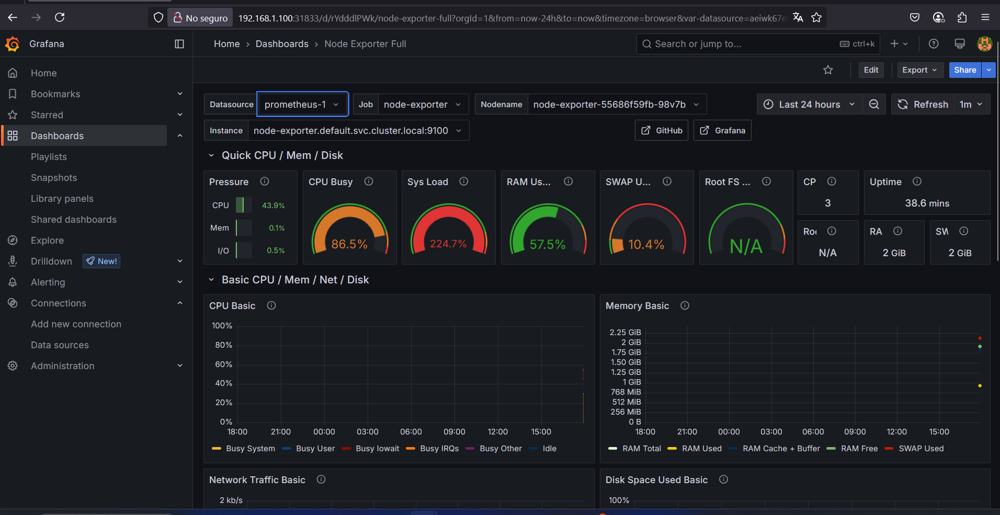


