# <p align="center"> Kubernetes: Gestió de Recursos, Probes i Alta Disponibilitat </p>
------------
En aquesta fase hem començat a aplicar bones pràctiques relacionades amb l'optimització de recursos i la supervisió de l'estat dels pods dins del nostre entorn Kubernetes. Aquesta part se centra en tres aspectes bàsics: **assignació de recursos, probes de salut, i verificació de l'estat real del pod.**

## Assignació de recursos (CPU i Memòria)
Per tal d'evitar que els pods utilitzin més recursos dels que els pertoquen o que es quedin sense recursos mínims, hem afegit la secció resources dins del fitxer webserver-deployment.yaml.
<br>
Aquest apartat permet definir:
•	requests: els recursos **mínims** que el pod necessita per executar-se.
•	limits: els recursos **màxims** que pot arribar a consumir.
<br>
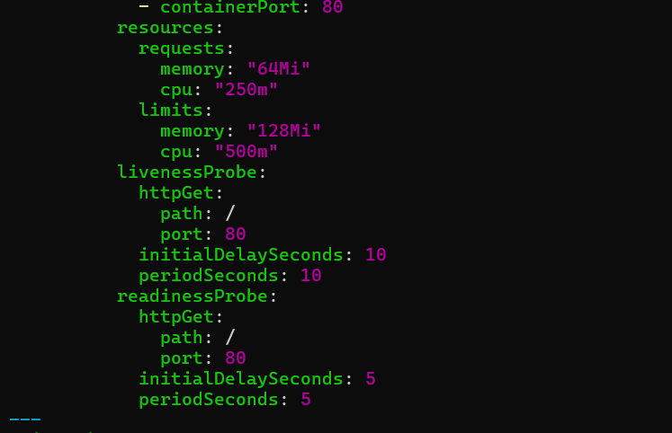
<br>
Això ens permet controlar l'assignació justa i equilibrada dels recursos del node.
## Probes de salut: Liveness i Readiness
També hem afegit dues probes molt importants per a la gestió d'aplicacions estables:
•	**livenessProbe:** comprova que el servei continua viu. Si falla, el pod es reinicia.
•	**readinessProbe:** comprova si el pod està llest per rebre peticions. Si falla, es deixa de derivar-li trànsit.
Aquestes probes són especialment útils en escenaris reals per garantir un entorn estable i amb menys downtime.
<br>
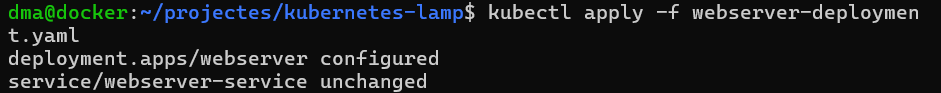
<br>
## Verificació del Pod
Un cop desplegat, hem comprovat que els recursos i les probes estiguessin aplicades correctament mitjançant la comanda:
```
kubectl describe pod webserver-9b87d
```
A la sortida es poden veure clarament:
•	Els requests i limits aplicats
•	L’estat actual del pod com a Running
•	Les probes de liveness i readiness configurades correctament
<br>
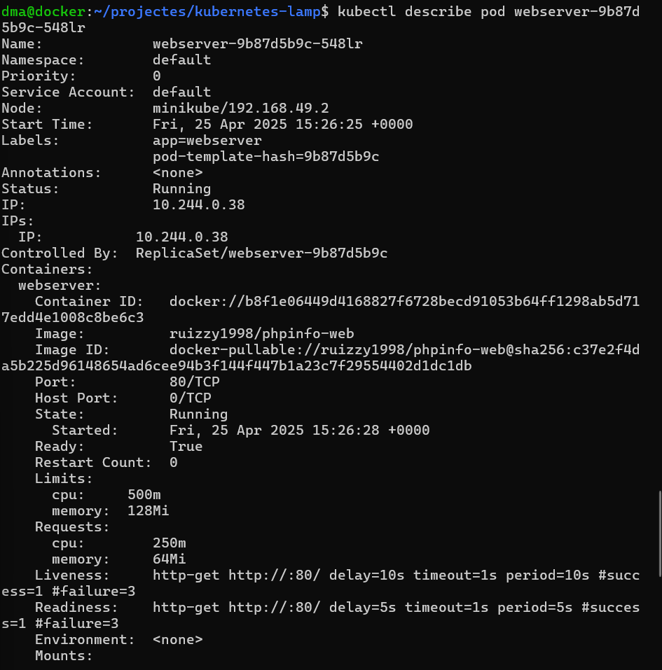
<br>
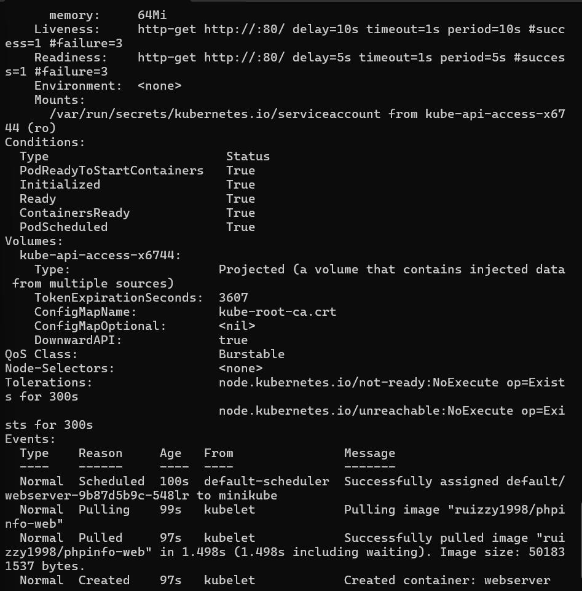
<br>
## Kubernetes: Escalat Manual i Automàtic
En aquesta segona part de la Fase 3, ens hem centrat a configurar l'escalabilitat dels nostres serveis web desplegats a Kubernetes. Hem treballat tant l’escalat manual com l’automàtic basat en consum de CPU.
## Escalat manual
Primer hem practicat l'escalat manual del nostre servei webserver augmentant el nombre de rèpliques.
Comanda utilitzada:
```
kubectl scale deployment webserver --replic
```
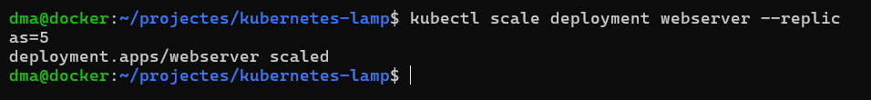
<br>
Amb aquesta comanda, hem passat de 3 a 5 rèpliques manualment.
Hem pogut comprovar els canvis amb:
```
kubectl get deployments
```
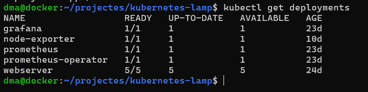
Veient que ara el Deployment webserver tenia 5 pods actius.
## Creació de l’HPA
Després, hem configurat l’escalat automàtic amb HPA perquè Kubernetes pugui adaptar el nombre de rèpliques del webserver de manera dinàmica segons el consum de CPU.
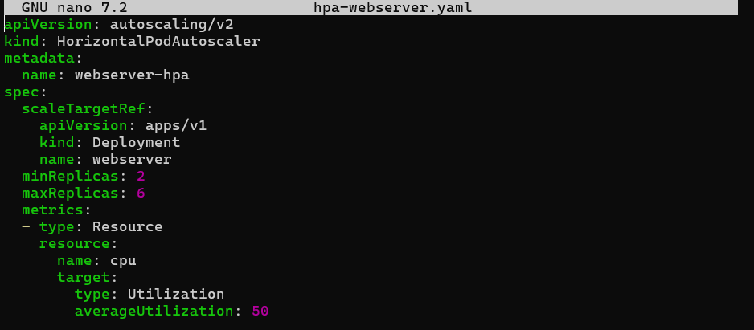
## Explicació del YAML
**scaleTargetRef**: indica que volem escalar el Deployment anomenat webserver.
**minReplicas**: el nombre mínim de pods serà 2.
**maxReplicas**: el nombre màxim de pods serà 6.
**averageUtilization**: si el consum de CPU supera el 50%, Kubernetes crearà nous pods automàticament.
## Desplegament de l’HPA
Hem aplicat la configuració amb:
```
kubectl apply -f hpa-webserver.yaml
```
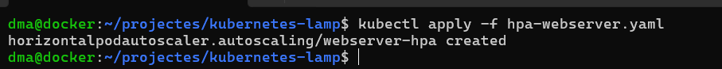
<br>
I hem comprovat que l’HPA estava funcionant amb:
```
kubectl get hpa
```
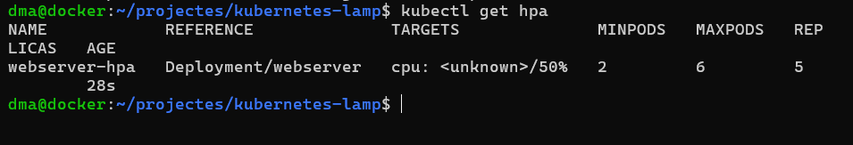
<br>
Aquesta comanda ens ha permès veure l’ús real de CPU i memòria de tots els pods. En el nostre cas, els pods del webserver consumeixen entre 2m i 3m de CPU, molt per sota del 50% que hem definit com a límit al HPA. Això explica per què l’autoscaler no ha incrementat el nombre de rèpliques.
```
kubectl top pods
```
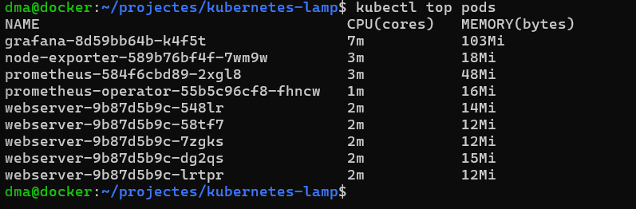
<br>
## Kubernetes: Balanceig de Càrrega i Accés Extern
En aquesta part hem treballat com exposar el nostre servei webserver a l'exterior, assegurant un accés distribuït i fiable. Hem utilitzat dos mecanismes habituals a Kubernetes: NodePort i Ingress Controller.
## Accés amb NodePort
En el nostre fitxer webserver-deployment.yaml, ja teníem definida l’exposició del servei mitjançant un Service de tipus NodePort:

<br>
Per poder accedir al servei web des del navegador de la meva màquina principal (fora de Minikube), he fet servir la comanda socat per crear un **pont entre el port del servei NodePort del clúster i el port local** del meu host:
```
sudo socat TCP-LISTEN:30080,reuseaddr, fork
```
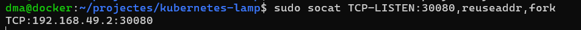
<br>
Això permet accedir al servei via navegador amb:
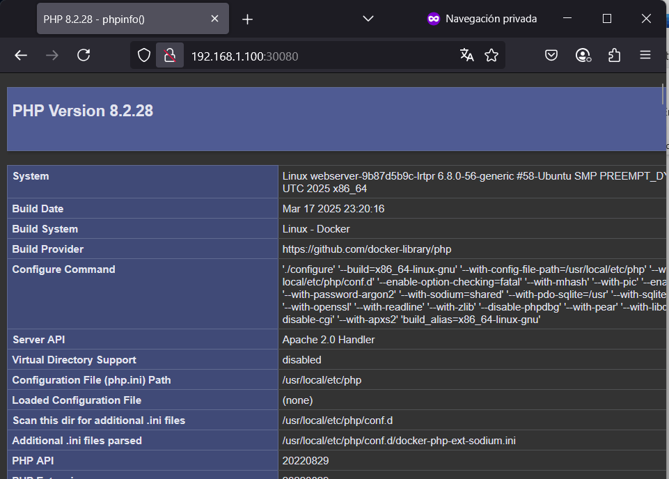
<br>
## Tolerància a errades i resiliència del sistema
En aquesta última part de la Fase 3 hem volgut comprovar si el nostre servei web desplegat a Kubernetes és **realment capaç de recuperar-se automàticament** quan alguna cosa falla. Per això hem posat a prova les probes de salut (livenessProbe i readinessProbe) que havíem configurat anteriorment al fitxer webserver-deployment.yaml.
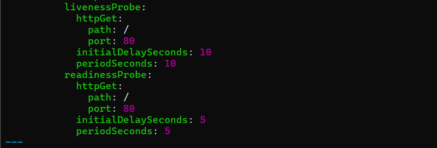
<br>
## Simulació d'una fallada interna
Per provocar un error dins del pod i veure com reacciona Kubernetes, hem fet una acció manual que trenca el funcionament de la web: hem mogut l’arxiu index.php fora de la carpeta pública.
Comanda utilitzada:
```
kubectl exec -it webserver-9b87d5b9c-58tf7 -- /bin/sh
```
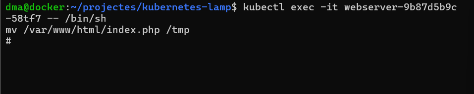
<br>
kubectl get pods mostra que el pod ha estat reiniciat gràcies a la livenessProbe.
El pod afectat mostrava RESTARTS: 1, cosa que indica que **la livenessProbe ha detectat la fallada i Kubernetes ha reiniciat el contenidor.**
```
kubectl get pods
```
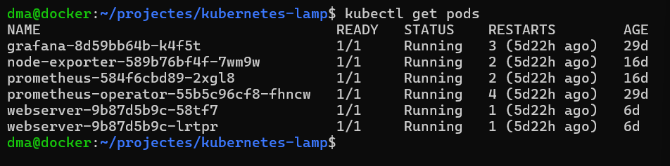
