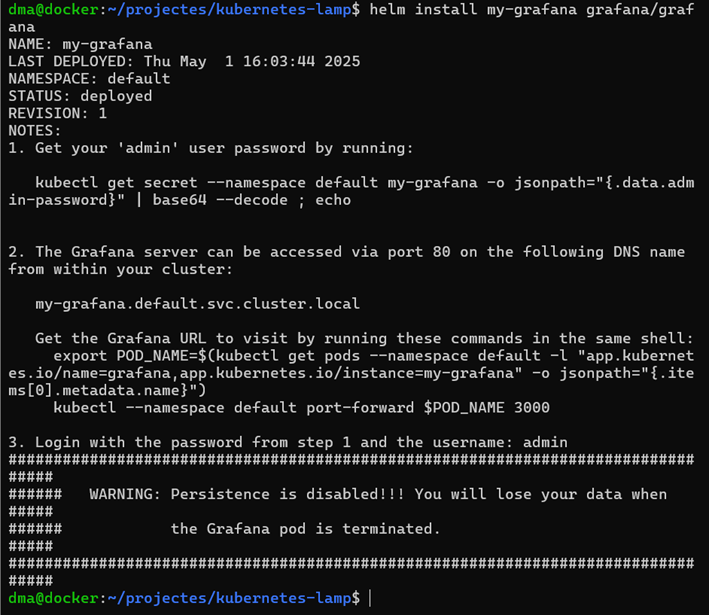

# 
  Kubernetes: eines complementaries 

------------
## Què és Helm
Helm és un gestor de paquets per a Kubernetes. Permet instal·lar aplicacions complexes com Grafana, WordPress o Prometheus de forma molt més senzilla, utilitzant “charts” predefinits.
## Instal·lació de Helm
A la nostra màquina Ubuntu hem fet:

 
Un cop instal·lat, ho hem confirmat amb:

 
## Desplegament d’una app amb Helm
Per demostrar el funcionament, hem instal·lat **Grafana** amb Helm:

 
Això ha creat tots els recursos necessaris (Deployment, Service, PVC...) amb un sol comandament.
## Comprovació de l'estat

 
Per eliminar-ho:

 
## Introducció a Istio
Istio és una plataforma de **service mesh** que s’integra amb Kubernetes per controlar i protegir el trànsit entre serveis del clúster. Amb Istio podem fer:
•	Control d’autenticació i autorització
•	Rutes de trànsit avançades (A/B testing, canary, etc.)
•	Retries automàtics, timeouts, circuit breaking
•	Visualització del trànsit en temps real amb **Kiali**

## Limitacions del nostre entorn
Hem intentat activar Istio dins del nostre entorn Minikube amb:

 
Aquest error és degut al fet que Minikube necessita **més recursos dels que la nostra màquina virtual actual pot oferir.**

