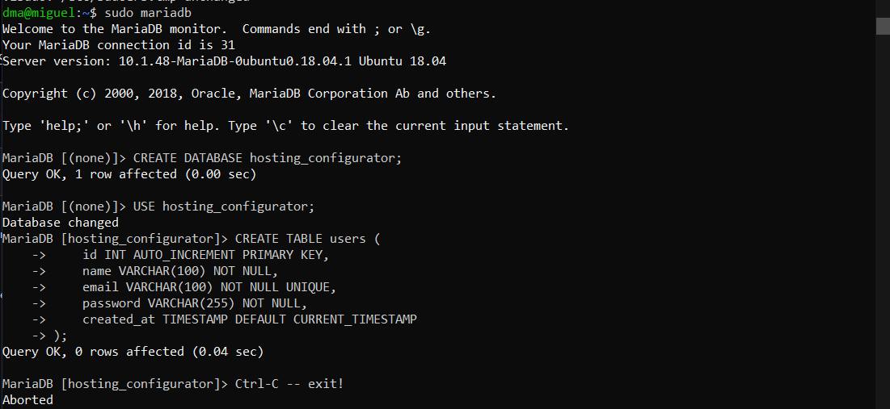

En aquest fixer trobem tota la configuració basica, que hem utilizat, amb l'objectiu de intal·lar i configurar la nostre base de dades. Primer de tot haurem de tenir tot instal·lat, per fer-ho seguim aquest passos (si ja esta tot instal·lat passa al següent apartat)

Una vegada fet, el que hem de fer ara es fer la configuració de la BD, primer de tot creem la BD:
Podem accedir amb tot dues comandes:
```
sudo mariadb
```
```
sudo mysql -u root -p
```
Una vegada dins, creem la base de dades:
```
CREATE DATABASE nom_bd;
```

