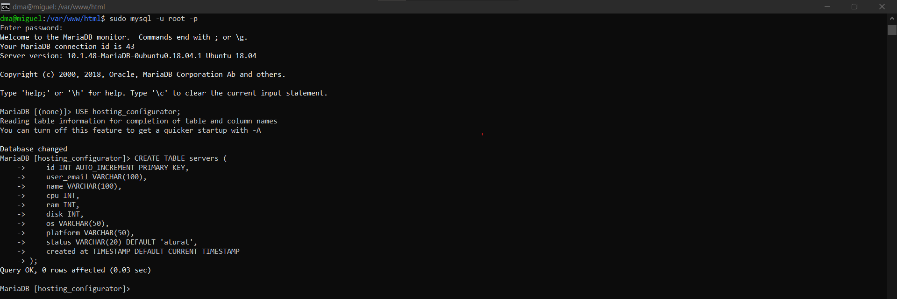

# <p align="center">  Configuracio BD  </p>
------------
En aquest fixer trobem tota la configuració basica, que hem utilizat, amb l'objectiu de intal·lar i configurar la nostre base de dades. Primer de tot haurem de tenir tot instal·lat, per fer-ho seguim aquest passos (si ja esta tot instal·lat passa al següent apartat)

Una vegada fet, el que hem de fer ara es fer la configuració de la BD, primer de tot creem la BD:
Podem accedir amb tot dues comandes:
```
sudo mariadb
```
```
sudo mysql -u root -p
```
Una vegada dins, creem la base de dades:
```
CREATE DATABASE nom_bd;
```

Seguidament el següent pas, es crear el usuari:
```
CREATE USER 'nom_usuari'@'localhost' IDENTIFIED BY 'contrasenya';
```
I configurar-ho amb els permisos corresponents:
```
GRANT ALL PRIVILEGES ON configurador_hosting.* TO 'dma'@'localhost';
```
I apliquem canvis:
```
FLUSH PRIVILEGES;
```

Seguidament haurem de fer la següent taula:
```
CREATE TABLE servers (
    id INT AUTO_INCREMENT PRIMARY KEY,
    user_email VARCHAR(100),
    name VARCHAR(100),
    cpu INT,
    ram INT,
    disk INT,
    os VARCHAR(50),
    platform VARCHAR(50),
    status VARCHAR(20) DEFAULT 'aturat',
    created_at TIMESTAMP DEFAULT CURRENT_TIMESTAMP
);
```


