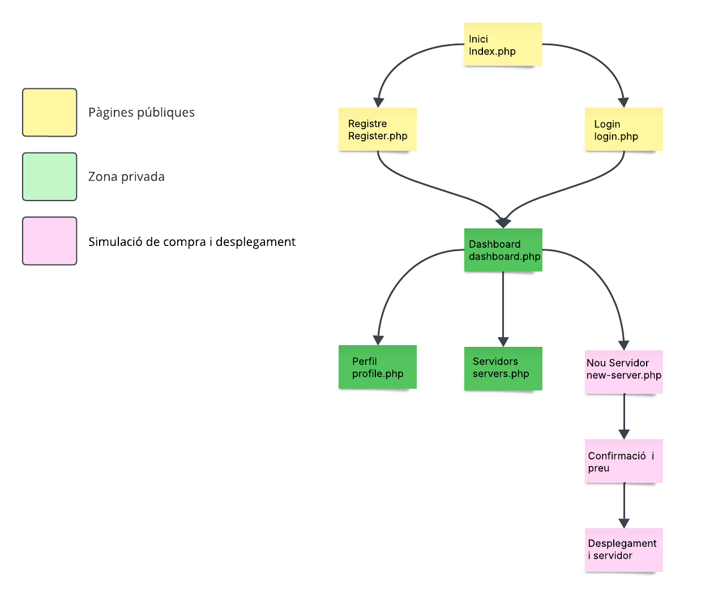
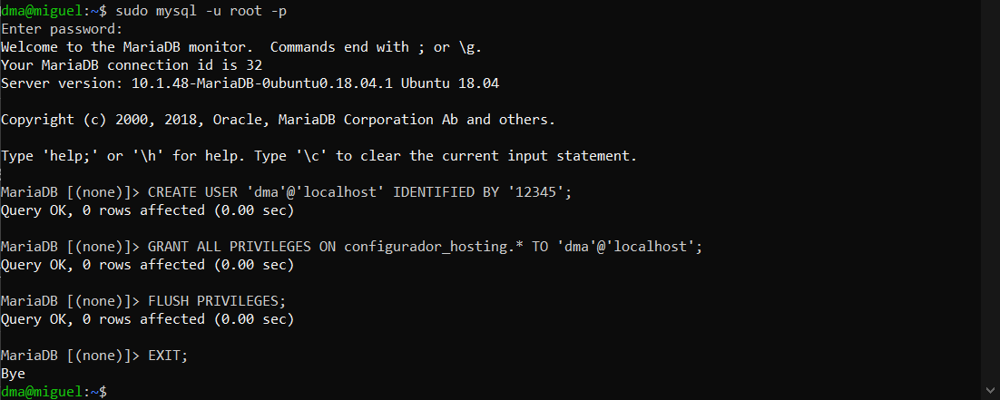
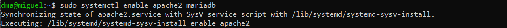
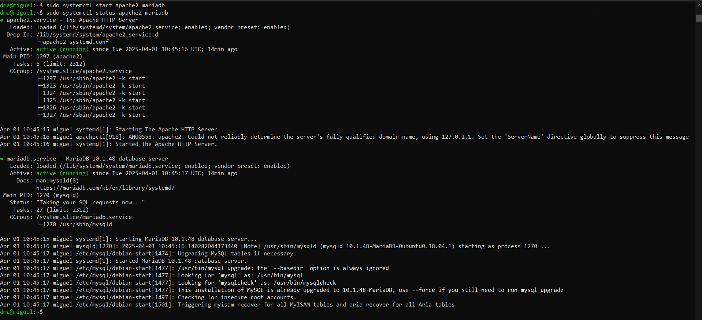
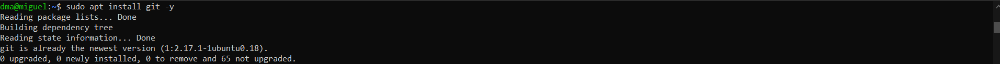
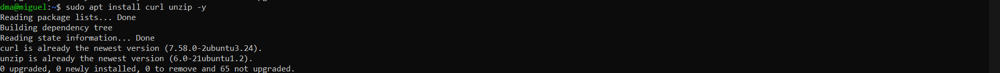
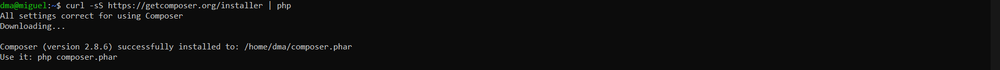

# <p align="center">  Planificació de l’oferta  </p>
------------
Opcions que oferirem:
- Espai de disc: 20GB, 50GB, 100GB
- Transferència mensual: 500GB, 1TB, il·limitada
- CPU: 1vCPU, 2vCPU, 4vCPU
- RAM: 1GB, 2GB, 4GB
- Sistema Operatiu: Ubuntu, Debian, Windows Server

Serveis addicionals:
- Servidor Web (Apache)
- Base de dades (MySQL)
- FTP

Plataformes preinstal·lades:
- WordPress
- Nextcloud
- PrestaShop

### Preus orientatius (pots ajustar segons vulguis):

| **Element**               | **Opció**                         | **Preu/mes (€)** |
|---------------------------|-----------------------------------|------------------|
| **Espai de disc**         | 20GB                              | 5                |
|                           | 50GB                              | 10               |
|                           | 100GB                             | 15               |
| **Transferència mensual** | 500GB                             | 5                |
|                           | 1TB                               | 10               |
|                           | Il·limitada                       | 20               |
| **CPU**                   | 1vCPU                             | 5                |
|                           | 2vCPU                             | 10               |
|                           | 4vCPU                             | 15               |
| **RAM**                   | 1GB                               | 5                |
|                           | 2GB                               | 10               |
|                           | 4GB                               | 15               |
| **SO**                    | Ubuntu/Debian                     | 0                |
|                           | Windows Server                    | 10               |
| **Plataforma preinstal·lada** | WordPress/Nextcloud/PrestaShop | 5                |


# <p align="center"> Planificació del lloc web  </p>
------------
Aquest és el nostre esquema inicial, amb l'objectiu de representar el nostre web i la seva interfície, ho hem fet amb l'eina [Lucidchart](https://www.lucidchart.com).
<br>

<br>
Aixì es com hem implementat el nostre sistema de registre i login, per arribar fins aqui:

Per fer això haurem de crear una base de dades (la informacio es troba a 'Configuracio BD'), una vegada creat i configurat haurem de crear el següents arxius:
- db.php
- index.php
- register.php
- login.php
- logout.php
- new-server.php
- servers.php

<br>
IMPORTANT la ruta d'aquests fixers sempres es: '/var/www/html'
<br>

Seguidament nosaltres hem creat una carpeta dins d'aquesta ruta amb el nom 'includes', i dins d'aquesta carpeta només haura d'estar el fitxer db.php <br>
Començant per el 'db.php' ja que aquest fa de connexió amb la base de dades, per fer-ho, nosaltres ho hem fet d'aquesta manera:
```
<?php
$host = 'localhost';
$db = 'hosting_configurator'; // posar el nom de la vostra bd
$user = 'dma'; // l'usuari que has creat
$pass = '12345'; // la seva contrasenya

try {
    $pdo = new PDO("mysql:host=$host;dbname=$db", $user, $pass);
    $pdo->setAttribute(PDO::ATTR_ERRMODE, PDO::ERRMODE_EXCEPTION);
} catch (PDOException $e) {
    die("Error de connexió: " . $e->getMessage());
}
?>
```
Seguidament pasem a fer l'arxiu del index, on es trobaran dos enllaços tant per a registrar-se, com per iniciar sessió. index.php:
```
<?php
session_start();
?>
<!DOCTYPE html>
<html>
<head>
    <title>Benvingut al Configurador de Hosting</title>
</head>
<body>
    <h1>Pagina d'inici</h1>
    <p><a href="register.php">Registrar-se</a> | <a href="login.php">Iniciar Sessió</a></p>
</body>
</html>
```
Deprés haurem de fer el arxiu de registre register.php:
```
<?php
session_start();
require 'includes/db.php';

if ($_SERVER["REQUEST_METHOD"] == "POST") {
    $name = $_POST["name"];
    $email = $_POST["email"];
    $password = password_hash($_POST["password"], PASSWORD_DEFAULT);

    $stmt = $pdo->prepare("INSERT INTO users (name, email, password) VALUES (?, ?, ?)");
    try {
        $stmt->execute([$name, $email, $password]);
        $_SESSION['user'] = $email;
        header("Location: dashboard.php");
    } catch (PDOException $e) {
        echo "Error: aquest correu ja està registrat.";
    }
}
?>

<form method="POST">
    Nom: <input type="text" name="name" required><br>
    Correu electrònic: <input type="email" name="email" required><br>
    Contrasenya: <input type="password" name="password" required><br>
    <input type="submit" value="Registrar-se">
</form>
```
I el per iniciar sessió, login.php:
```
<?php
session_start();
require 'includes/db.php';

if ($_SERVER["REQUEST_METHOD"] == "POST") {
    $email = $_POST["email"];
    $password = $_POST["password"];

    $stmt = $pdo->prepare("SELECT * FROM users WHERE email = ?");
    $stmt->execute([$email]);
    $user = $stmt->fetch();

    if ($user && password_verify($password, $user['password'])) {
        $_SESSION['user'] = $user['email'];
        header("Location: dashboard.php");
    } else {
        echo "Credencials incorrectes.";
    }
}
?>

<form method="POST">
    Correu electrònic: <input type="email" name="email" required><br>
    Contrasenya: <input type="password" name="password" required><br>
    <input type="submit" value="Iniciar sessió">
</form>
```
Seguim amb el codi del fixer, logout.php
```
<?php
session_start();
session_destroy();
header("Location: index.php");
exit;
```
Contiuem fent el servers.php
```
<?php
session_start();
require 'includes/db.php';

if (!isset($_SESSION['user'])) {
    header("Location: login.php");
    exit;
}

$email = $_SESSION['user'];

// Accions
if (isset($_GET['action']) && isset($_GET['id'])) {
    $id = $_GET['id'];

    if ($_GET['action'] === 'engegar') {
        $pdo->prepare("UPDATE servers SET status = 'actiu' WHERE id = ? AND user_email = ?")->execute([$id, $email]);
    }

    if ($_GET['action'] === 'aturar') {
        $pdo->prepare("UPDATE servers SET status = 'aturat' WHERE id = ? AND user_email = ?")->execute([$id, $email]);
    }
}

// Carrega de servidors
$stmt = $pdo->prepare("SELECT * FROM servers WHERE user_email = ?");
$stmt->execute([$email]);
$servers = $stmt->fetchAll();
?>

<!DOCTYPE html>
<html>
<head>
    <title>Els meus servidors</title>
    <link rel="stylesheet" href="style.css">
</head>
<body>
<div class="container">
    <h2>Els meus servidors</h2>

    <?php if (empty($servers)): ?>
        <p>No tens cap servidor creat encara.</p>
    <?php else: ?>
        <table>
            <tr>
                <th>Nom</th>
                <th>CPU</th>
                <th>RAM</th>
                <th>Disc</th>
                <th>SO</th>
                <th>Plataforma</th>
                <th>Estat</th>
                <th>Accions</th>
            </tr>
            <?php foreach ($servers as $srv): ?>
            <tr>
                <td><?= htmlspecialchars($srv['name']) ?></td>
                <td><?= $srv['cpu'] ?> vCPU</td>
                <td><?= $srv['ram'] ?> GB</td>
                <td><?= $srv['disk'] ?> GB</td>
                <td><?= htmlspecialchars($srv['os']) ?></td>
                <td><?= htmlspecialchars($srv['platform']) ?></td>
                <td><?= $srv['status'] ?></td>
                <td>
                    <?php if ($srv['status'] === 'aturat'): ?>
                        <a href="?action=engegar&id=<?= $srv['id'] ?>">Engegar</a>
                    <?php else: ?>
                        <a href="?action=aturar&id=<?= $srv['id'] ?>">Aturar</a>
                    <?php endif; ?>
                </td>
            </tr>
            <?php endforeach; ?>
        </table>
    <?php endif; ?>

    <p><a href="dashboard.php">Tornar al panell</a></p>
</div>
</body>
</html>
```
Per últim farem el new-server.php
```
<?php
ini_set('display_errors', 1);
error_reporting(E_ALL);
session_start();
require 'includes/db.php';

if (!isset($_SESSION['user'])) {
    header("Location: login.php");
    exit;
}

$msg = "";

if ($_SERVER["REQUEST_METHOD"] == "POST") {
    $name = $_POST['name'];
    $cpu = $_POST['cpu'];
    $ram = $_POST['ram'];
    $disk = $_POST['disk'];
    $os = $_POST['os'];
    $platform = $_POST['platform'];

    // Calcul preu
    $preu = 0;
    $preu += ($disk == 20) ? 5 : (($disk == 50) ? 10 : 15);
    $preu += ($cpu == 1) ? 5 : (($cpu == 2) ? 10 : 15);
    $preu += ($ram == 1) ? 5 : (($ram == 2) ? 10 : 15);
    if ($platform != "cap") $preu += 5;

    // Inserir a BD
    $stmt = $pdo->prepare("INSERT INTO servers (user_email, name, cpu, ram, disk, os, platform, status) VALUES (?, ?, ?, ?, ?, ?, ?, 'aturat')");
    $stmt->execute([$_SESSION['user'], $name, $cpu, $ram, $disk, $os, $platform]);

    $msg = "Servidor creat correctament. Preu mensual estimat: {$preu} €";
}
?>

<!DOCTYPE html>
<html>
<head>
    <title>Nou servidor</title>
    <link rel="stylesheet" href="style.css">
</head>
<body>
<div class="container">
    <h2>Configura un nou servidor</h2>
    <?php if ($msg) echo "<p>$msg</p>"; ?>
    <form method="POST">
        Nom del servidor: <input type="text" name="name" required>
        <label>CPU:</label>
        <select name="cpu">
            <option value="1">1 vCPU</option>
            <option value="2">2 vCPU</option>
            <option value="4">4 vCPU</option>
        </select>

        <label>RAM:</label>
        <select name="ram">
            <option value="1">1 GB</option>
            <option value="2">2 GB</option>
            <option value="4">4 GB</option>
        </select>

        <label>Disc:</label>
        <select name="disk">
            <option value="20">20 GB</option>
            <option value="50">50 GB</option>
            <option value="100">100 GB</option>
        </select>

        <label>Sistema Operatiu:</label>
        <select name="os">
            <option value="Ubuntu">Ubuntu</option>
            <option value="Debian">Debian</option>
            <option value="Windows">Windows Server</option>
        </select>

        <label>Plataforma:</label>
        <select name="platform">
            <option value="cap">Cap</option>
            <option value="WordPress">WordPress</option>
            <option value="Nextcloud">Nextcloud</option>
            <option value="PrestaShop">PrestaShop</option>
        </select>

        <input type="submit" value="Crear servidor">
    </form>
    <p><a href="dashboard.php">Tornar</a></p>
</div>
</body>
</html>

```
# <p align="center"> Planificació dels serveis  </p>
------------
Configuracio del Maquinari:

Configuracio de les versions:
Els primers passos haurem de ser instal·lar els serveis necessaris, per fer-ho haurem de posar les següents comandes:
Servidor Web + PHP + Base de Dades (LAMP)
```
sudo apt install apache2 -y
```

```
sudo apt install php libapache2-mod-php php-mysql php-cli php-curl php-xml php-mbstring -y
```

```
sudo apt install mariadb-server mariadb-client -y
```

```
sudo systemctl enable apache2 mariadb
```

```
sudo systemctl start apache2 mariadb
```
```
sudo systemctl status apache2 mariadb
```


Instal·lacions de les plataformes:
-----------
```
sudo apt install git -y
```

```
sudo apt install curl unzip -y
```

```
curl -sS https://getcomposer.org/installer | php
```

```
sudo mv composer.phar /usr/local/bin/composer
```


# README
### [Fase 1](https://github.com/miguelIH/Projecte-Github/blob/main/01_Projecte-Docker-Orquestradors-Basic/Fase_1_Configuracions_i_desplegament_amb_Docker_Compose/Documentacio.md)
### [Fase 2](https://github.com/miguelIH/Projecte-Github/blob/main/01_Projecte-Docker-Orquestradors-Basic/Fase_2_Orquestraci%C3%B3_i_desplegament_amb_Docker_Swarm/Documentacio.md)
### [Fase 3](https://github.com/miguelIH/Projecte-Github/blob/main/01_Projecte-Docker-Orquestradors-Basic/Fase_3_Seguretat_a_Docker_Swarm/Documentacio.md)
### [Fase 4](https://github.com/miguelIH/Projecte-Github/blob/main/01_Projecte-Docker-Orquestradors-Basic/Fase_4_Orquestraci%C3%B3_amb_Kubernetes/Documentacio.md)


