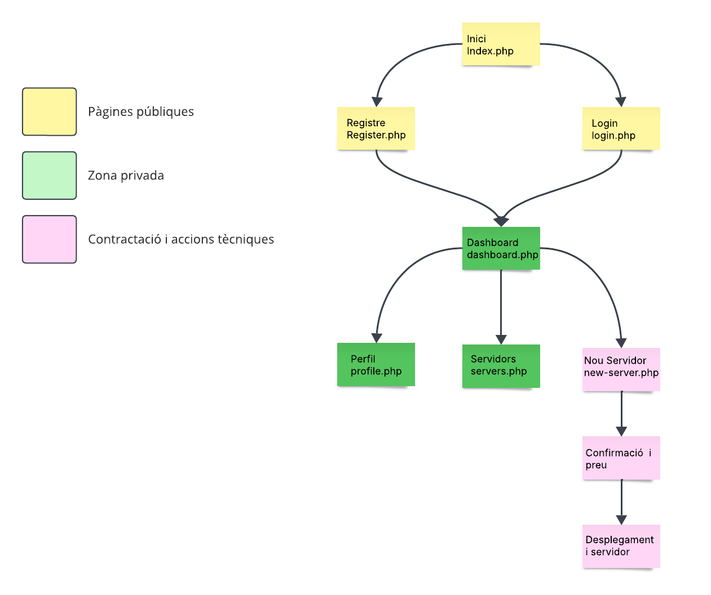

# <p align="center">  Planificació de l’oferta  </p>
------------
Opcions que oferirem:
- Espai de disc: 20GB, 50GB, 100GB
- Transferència mensual: 500GB, 1TB, il·limitada
- CPU: 1vCPU, 2vCPU, 4vCPU
- RAM: 1GB, 2GB, 4GB
- Sistema Operatiu: Ubuntu, Debian, Windows Server

Serveis addicionals:
- Servidor Web (Apache)
- Base de dades (MySQL)
- FTP

Plataformes preinstal·lades:
- WordPress
- Nextcloud
- PrestaShop

### Preus orientatius (pots ajustar segons vulguis):

| **Element**               | **Opció**                         | **Preu/mes (€)** |
|---------------------------|-----------------------------------|------------------|
| **Espai de disc**         | 20GB                              | 5                |
|                           | 50GB                              | 10               |
|                           | 100GB                             | 15               |
| **Transferència mensual** | 500GB                             | 5                |
|                           | 1TB                               | 10               |
|                           | Il·limitada                       | 20               |
| **CPU**                   | 1vCPU                             | 5                |
|                           | 2vCPU                             | 10               |
|                           | 4vCPU                             | 15               |
| **RAM**                   | 1GB                               | 5                |
|                           | 2GB                               | 10               |
|                           | 4GB                               | 15               |
| **SO**                    | Ubuntu/Debian                     | 0                |
|                           | Windows Server                    | 10               |
| **Plataforma preinstal·lada** | WordPress/Nextcloud/PrestaShop | 5                |


# <p align="center"> Planificació del lloc web  </p>
------------
Aquest és el nostre esquema inicial, amb l'objectiu de representar el nostre web i la seva interfície, ho hem fet amb l'eina [Lucidchart](https://www.lucidchart.com).
<br>

<br>

# <p align="center"> Planificació dels serveis  </p>
------------
Configuracio del Maquinari:

Configuracio de les versions:
Els primers passos haurem de ser instal·lar els serveis necessaris, per fer-ho haurem de posar les següents comandes:
Servidor Web + PHP + Base de Dades (LAMP)
```
sudo apt install apache2 -y
```
foto
```
sudo apt install apache2 -y
```
foto
```
sudo apt install php libapache2-mod-php php-mysql php-cli php-curl php-xml php-mbstring -y
```
foto
```
sudo apt install mariadb-server mariadb-client -y
```
foto
```
sudo systemctl enable apache2 mariadb
```
foto
```
sudo systemctl start apache2 mariadb
```
foto

Instal·lacions de les plataformes:
-----------
```
sudo apt install git -y
```

```
sudo apt install curl unzip -y
```

```
curl -sS https://getcomposer.org/installer | php
```

```
sudo mv composer.phar /usr/local/bin/composer
```


# README
### [Fase 2](https://github.com/miguelIH/Projecte-Github/blob/main/01_Projecte-Docker-Orquestradors-Basic/Fase_2_Orquestraci%C3%B3_i_desplegament_amb_Docker_Swarm/Documentacio.md)
### [Fase 3](https://github.com/miguelIH/Projecte-Github/blob/main/01_Projecte-Docker-Orquestradors-Basic/Fase_3_Seguretat_a_Docker_Swarm/Documentacio.md)
### [Fase 4](https://github.com/miguelIH/Projecte-Github/blob/main/01_Projecte-Docker-Orquestradors-Basic/Fase_4_Orquestraci%C3%B3_amb_Kubernetes/Documentacio.md)


